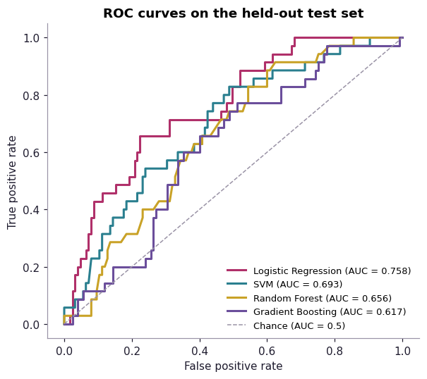
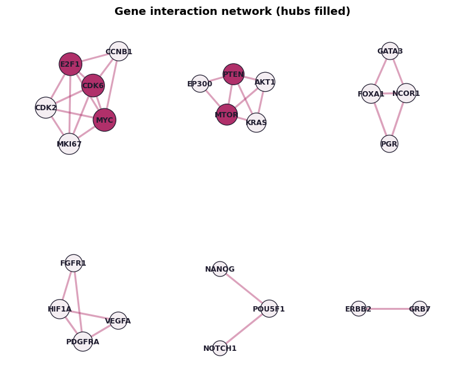
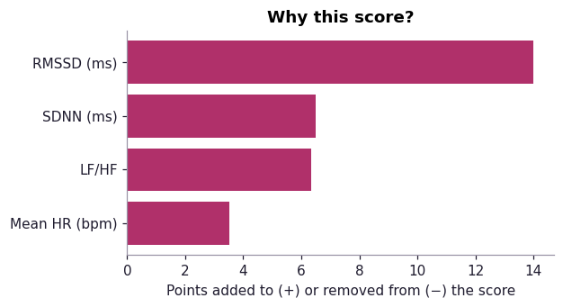
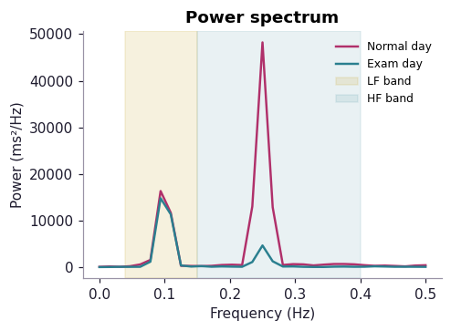
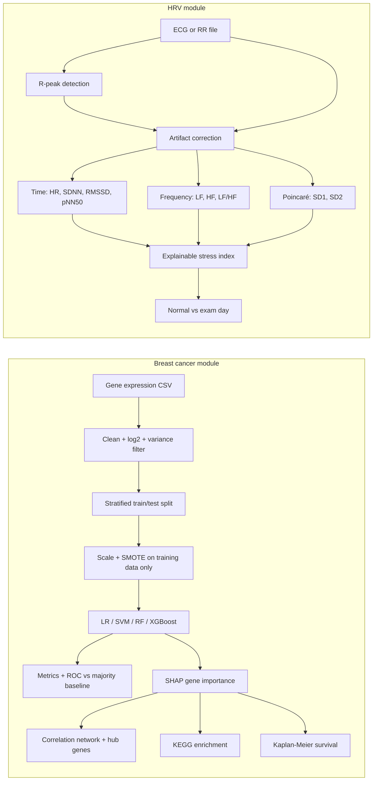

# BioXAI: explainable AI for biomedical biomarkers

BioXAI is an open-source web app that applies explainable machine learning to two kinds of
biomedical data, and shows **why** each result was reached:

- **Breast cancer stage analysis**: early vs late stage from gene expression (TCGA-BRCA), with
  model comparison, SHAP gene explanations, gene networks, hub genes, KEGG pathways and survival.
- **HRV stress check**: heart rate variability from ECG or RR intervals (BIOPAC, Kubios,
  smartwatches), Kubios-style charts, an explainable stress index, and a normal day vs exam day comparison.
- **Learn**: plain-language guides on breast cancer, screening, stress, HRV and explainable AI.

**Live app:** [https://<your-app>.streamlit.app](https://bioxai-research-lab.streamlit.app) 

> For research and education only. BioXAI is not a medical device and does not diagnose disease.

---

## Screenshots

| Model comparison | Gene network and hubs |
|---|---|
|  |  |
| **Explainable stress index** | **Normal vs exam day spectrum** |
|  |  |

Also: [gene importance](docs/screenshots/gene_importance.png) ·
[survival curve](docs/screenshots/survival.png) · [Poincaré plot](docs/screenshots/poincare.png).
Add screenshots of the running app here after deployment.

---

## Workflow



---

## Methodology

### Breast cancer stage
Based on *Biswas S., Huda T., Pal H., Gupta V.K., "Interpretable Machine Learning Framework for Gene
Regulatory Network and Pathway Analysis in Breast Cancer."*

1. **Data.** TCGA-BRCA RNA-seq (log2 normalised counts) from UCSC Xena. Stage I–II = early, III–IV = late.
2. **Preprocessing.** Genes with >20% missing values are removed, the rest median-imputed; optional
   log2(x+1); optional filter to the most variable genes.
3. **Leakage-safe evaluation.** The data are split (stratified, 80/20) *before* scaling and SMOTE, and
   both are fitted on the training set only, so no test information reaches the model.
4. **Models.** Logistic Regression, SVM (RBF), Random Forest, XGBoost (Gradient Boosting if XGBoost is
   unavailable). Reported: accuracy, balanced accuracy, precision, recall, specificity, F1, ROC-AUC,
   5-fold cross-validated AUC, and a **majority-class baseline** for honest comparison.
5. **Explanation.** SHAP (TreeExplainer / LinearExplainer / KernelExplainer); permutation importance
   as fallback. Direction = correlation between a gene's value and its SHAP value.
6. **Biological validation.** Pearson correlation network at an adjustable threshold (paper: 0.5 vs
   0.7), hub genes by degree and betweenness centrality, KEGG enrichment through Enrichr (with the
   analysed genes as background, to avoid inflated enrichment), and Kaplan–Meier / log-rank survival
   by median expression split.

### HRV stress
Based on *Huda T., "Heart Rate Changes as an Indicator of Academic Stress in College Students,"*
B.Sc. (H) Biomedical Science dissertation, BCAS, University of Delhi, 2026 (BIOPAC MP36, modified
Lead II, Kubios HRV Scientific Lite 4.3.0).

1. **Input.** RR intervals (ms or s) or raw ECG; R-peaks found with a band-pass (5–15 Hz) energy
   detector (Pan–Tompkins style).
2. **Artifact correction.** Beats outside 300–2000 ms or >20% from the local median are interpolated.
3. **Time domain.** Mean/min/max HR, SDNN, RMSSD, pNN50.
4. **Frequency domain.** RR resampled at 4 Hz (cubic spline), detrended, Welch PSD; VLF, LF
   (0.04–0.15 Hz), HF (0.15–0.40 Hz), normalised units, LF/HF. Requires ≥ 2 minutes.
5. **Nonlinear.** Poincaré SD1, SD2, SD2/SD1.
6. **Explainable stress index (0–100).** Mean HR, SDNN, RMSSD and LF/HF are converted to z-scores
   against the person's own baseline (if given) or published resting norms (Nunan et al., 2010),
   signed so that positive = stress-like, weighted (RMSSD highest, as the most reliable short-term
   marker) and mapped to 0–100. Each marker's contribution is shown. This is a transparent research
   indicator, **not** a validated clinical score.
7. **Thesis baseline.** Normal-day values of the 10 thesis participants are included for comparison
   (note: those were 25–30 s recordings).

---

## Sample data

| File | What it is |
|---|---|
| `data/demo_gene_expression.csv` | **Synthetic** 800 samples × 41 genes, stage, survival. For trying the app. |
| `data/demo_rr_normal_day.txt`, `data/demo_rr_exam_day.txt` | **Synthetic** 5-minute RR series. |
| `scripts/prepare_tcga_xena.py` | Downloads **real** TCGA-BRCA from UCSC Xena and builds an app-ready CSV. |
| `scripts/make_demo_data.py` | Regenerates the synthetic demo files. |

```bash
python scripts/prepare_tcga_xena.py                    # genes named in the paper
python scripts/prepare_tcga_xena.py --genes genes.txt  # your own gene list
python scripts/prepare_tcga_xena.py --top-variance 2000
```

---

## Run locally

```bash
git clone https://github.com/<your-username>/bioxai.git
cd bioxai
pip install -r requirements.txt
streamlit run app.py
```

## Deploy free (Streamlit Community Cloud)

1. Push this folder to a public GitHub repository.
2. Go to https://share.streamlit.io, sign in with GitHub, click **Create app**.
3. Choose the repository, branch `main`, main file `app.py`, then **Deploy**.
4. Copy the link into this README, your CV and your emails.

(Hugging Face Spaces also works: create a Space with the Streamlit SDK and upload the files.)

---

## Project structure

```
bioxai/
├── app.py                      home page
├── pages/
│   ├── 1_Breast_Cancer_Stage.py
│   ├── 2_HRV_Stress_Check.py
│   └── 3_Learn.py
├── core/
│   ├── genomics.py             ML pipeline, SHAP, network, enrichment, survival
│   ├── hrv.py                  HRV metrics and stress index
│   └── plots.py                charts
├── data/                       demo data
├── scripts/                    data preparation
└── docs/screenshots/
```

## Limitations

- Results on the synthetic demo data are illustrative only.
- Stage prediction from bulk expression is a hard problem; performance on TCGA is modest and needs
  external validation (e.g. METABRIC) before any claim of clinical use.
- Correlation networks show co-expression, not causal regulation.
- The stress index is not clinically validated; HRV depends on breathing, posture, sleep, caffeine and age.
- Ultra-short recordings (< 1 min) give unstable HRV; 5 minutes seated is recommended.

## Citation

If you use BioXAI, please cite the two source works above and this repository.

## Author
Sriporna Biswas · Department of Computer Science & Engineering , Chandigarh University · `sripornab13@gmail.com`
Tanjidul Huda · Department of Biomedical Science, Bhaskaracharya College of Applied Sciences, 
University of Delhi · `tanjidulhuda@gmail.com` 

## License

MIT
